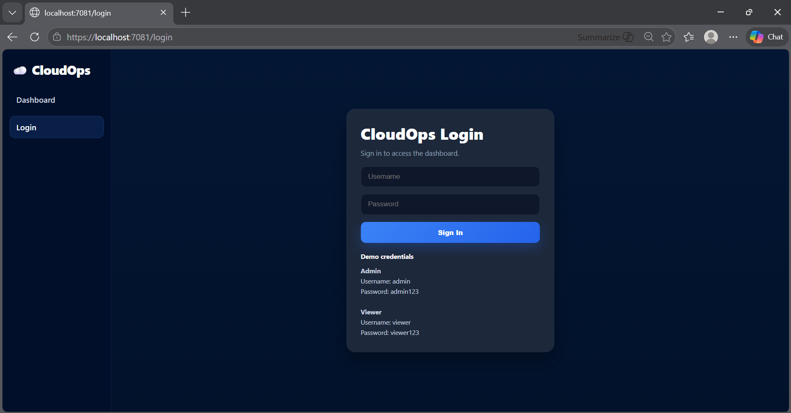
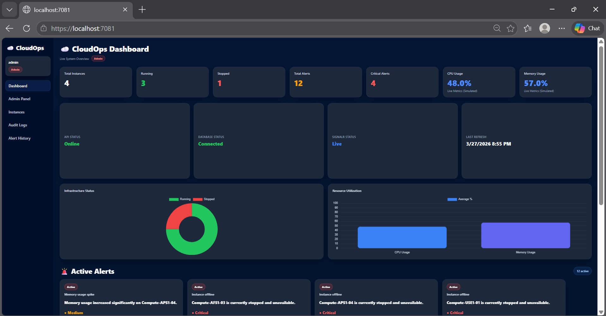
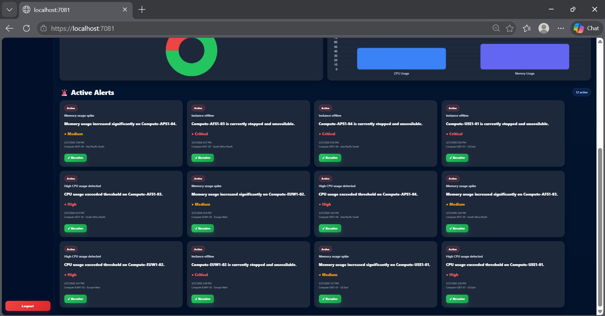
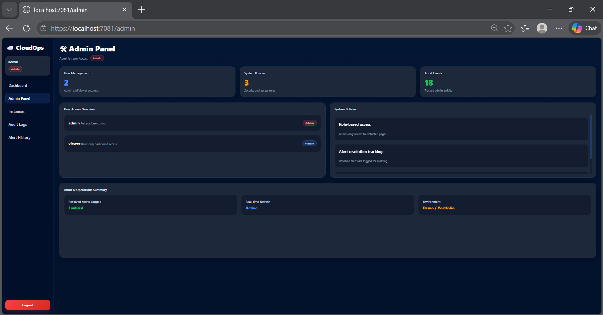
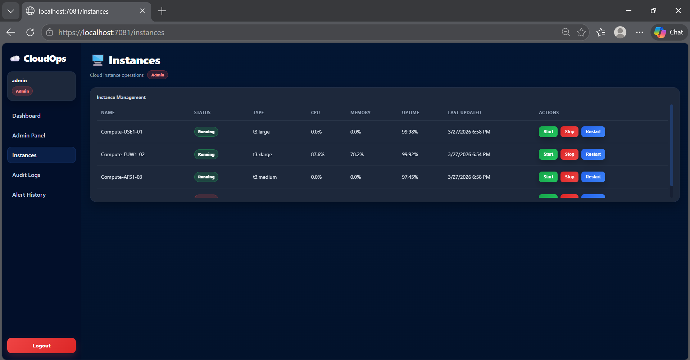
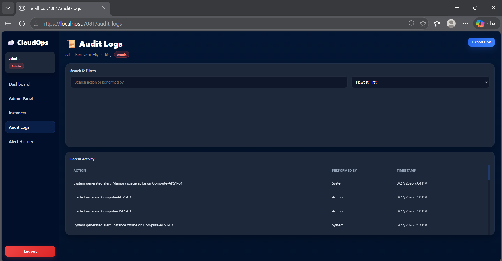
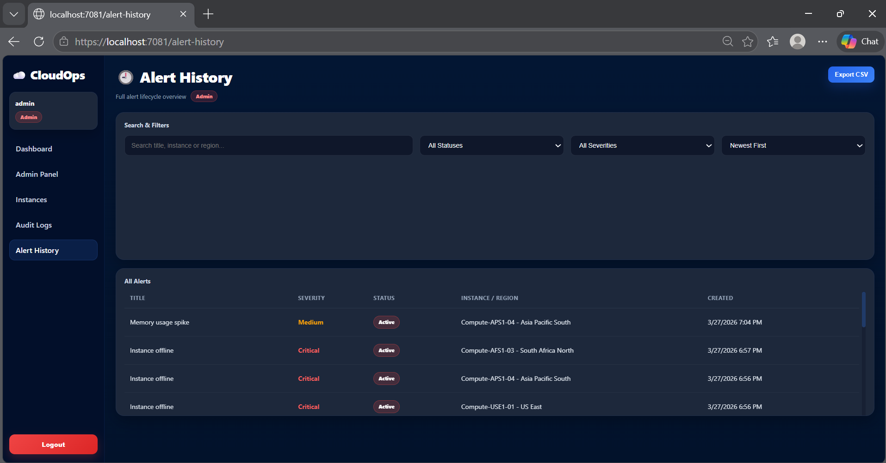
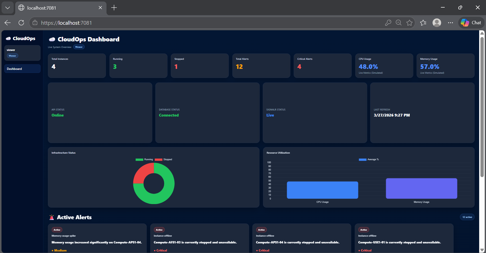
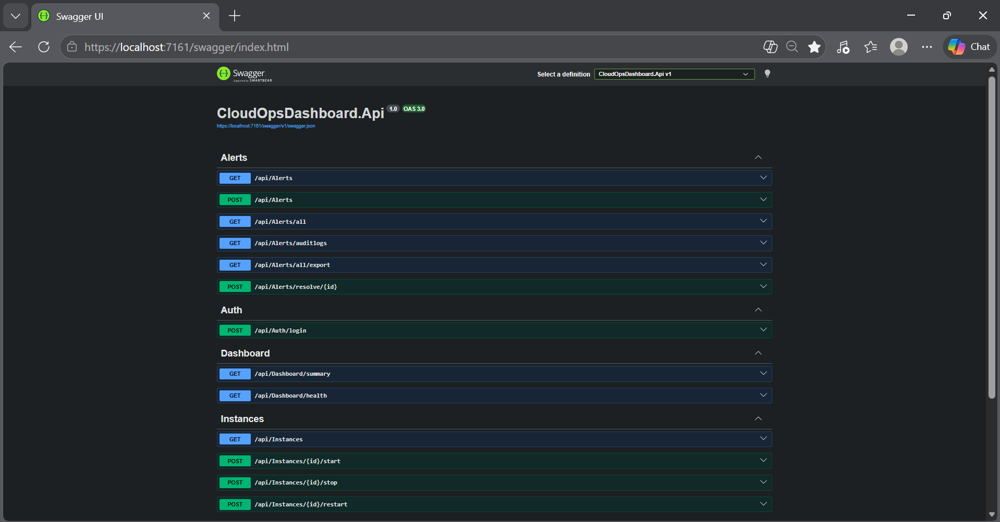

# CloudOps Dashboard


CloudOps Dashboard is a full-stack cloud operations monitoring and administration platform built with **Blazor**, **ASP.NET Core Web API**, **Entity Framework Core**, **SignalR**, and **SQL Server LocalDB**.

It simulates a real cloud control center by combining live infrastructure monitoring, alert management, instance operations, audit logging, role-based access control, reporting exports, and health status tracking in a single premium dashboard experience.

This project was built as an **industry-style portfolio project** to demonstrate full-stack engineering, cloud operations thinking, and modern dashboard design.

---

## Table of Contents

- [Overview](#overview)
- [Key Features](#key-features)
- [Screenshots](#screenshots)
- [Architecture](#architecture)
- [Tech Stack](#tech-stack)
- [Project Structure](#project-structure)
- [How to Run the Application](#how-to-run-the-application)
- [Database Setup](#database-setup)
- [Demo Credentials](#demo-credentials)
- [Role-Based Access](#role-based-access)
- [Exports](#exports)
- [Future Improvements](#future-improvements)
- [License](#license)
- [Author](#author)

---

## Overview

CloudOps Dashboard simulates how a cloud engineer or platform operations team would monitor and manage infrastructure from a centralized operations console.

The platform includes:

- a live dashboard for monitoring infrastructure and system health
- an admin panel for governance and operational summaries
- an instances page for managing cloud resources
- audit logs for traceability
- alert history for lifecycle visibility
- CSV exports for reporting
- database-driven authentication with Admin and Viewer roles

The goal of this project is to present more than a basic CRUD application. It is designed to reflect the feel of a real internal cloud operations platform.

---

## Key Features

### Dashboard Monitoring
- Total instances
- Running instances
- Stopped instances
- Total active alerts
- Critical alerts
- CPU and memory utilization metrics
- Infrastructure status donut chart
- Resource utilization chart
- Health status widgets:
  - API Status
  - Database Status
  - SignalR Status
  - Last Refresh

### Alert Management
- Live-feel alert generation
- Active alerts section
- Severity levels:
  - Critical
  - High
  - Medium
  - Low
- Resolve alert actions
- Alert history tracking
- Search, filter, and sort support

### Audit Logging
- Records user and system activity
- Search and sort functionality
- Cleaner table layout with mini-scroll
- CSV export support

### Instance Management
- View simulated cloud infrastructure
- Start instance
- Stop instance
- Restart instance
- Status badges and operational controls
- Scrollable operations table

### Authentication and Roles
- Database-driven login
- Admin and Viewer roles
- Role-based access control
- Local storage session persistence
- Demo credentials for testing

### Reporting and Exports
- Export Audit Logs to CSV
- Export Alert History to CSV

### Health and System Status
- API connection state
- Database connection state
- SignalR live status
- Last refresh timestamp

---

## Screenshots


### 1. Login Page


The login page serves as the secure entry point into the platform. It supports role-based access and provides demo credentials for both Admin and Viewer users.

### 2. Dashboard Overview


The dashboard overview presents the main operational summary of the platform, including infrastructure counts, alert metrics, health widgets, and live resource visualization. This acts as the primary cloud operations control center.

### 3. Dashboard Active Alerts


This section highlights the active alert engine of the platform. It demonstrates severity-based monitoring, timestamps, affected instances, and resolution actions.

### 4. Admin Panel


The admin panel provides an operational governance view of the platform. It includes user access summaries, system policy information, and audit-focused administrative details.

### 5. Instances Page


The instances page is used to manage cloud resources. It allows administrators to start, stop, and restart simulated instances while monitoring their operational status and metrics.

### 6. Audit Logs


The audit logs page tracks user and system events for accountability and traceability. It supports filtering, sorting, and CSV export for reporting workflows.

### 7. Alert History


The alert history page gives a full lifecycle view of alerts in the system. It includes search, filtering, sorting, severity indicators, timestamps, and export support.

### 8. Viewer Dashboard


The viewer dashboard demonstrates role-based access restrictions. It confirms that the application supports multiple user roles with tailored experiences.

### 9. Swagger API Documentation


The Swagger UI demonstrates the backend API layer that powers the CloudOps Dashboard platform.  
It exposes the application’s endpoints for authentication, dashboard data, alerts, audit logs, exports, health checks, and instance operations.

---

## Architecture

The solution follows a layered architecture to separate concerns and improve maintainability.

### `CloudOpsDashboard.Web`
Blazor frontend application responsible for:
- UI rendering
- navigation
- role-aware page access
- calling API endpoints
- handling session state

### `CloudOpsDashboard.Api`
ASP.NET Core Web API responsible for:
- serving dashboard data
- managing alerts
- handling audit logs
- authenticating users
- exporting CSV files
- exposing health endpoints
- supporting real-time features via SignalR

### `CloudOpsDashboard.Core`
Contains shared domain entities and core models used across the solution.

### `CloudOpsDashboard.Infrastructure`
Handles:
- Entity Framework Core data access
- database context
- migrations
- repositories
- seeding
- supporting infrastructure services

### Real-Time Layer
SignalR is used to create a live-feel dashboard experience and keep the platform aligned with cloud operations workflows.

---

## Tech Stack

### Frontend
- Blazor
- Razor Components
- Custom CSS
- JavaScript Interop

### Backend
- ASP.NET Core Web API
- SignalR
- Entity Framework Core

### Database
- SQL Server LocalDB

### Language / Framework
- C#
- .NET 10

### Development Tools
- Visual Studio
- SQL Server Management Studio
- Swagger UI

---

## Project Structure

```text
CloudOpsDashboard/
│
├── Screenshots/
│   ├── alert-history.png
│   ├── audit-logs.png
│   ├── dashboard-active-alerts.png
│   ├── dashboard-overview.png
│   ├── instances-page.png
│   ├── login-page.png
│   ├── viewer-dashboard.png
│   └── viewer-dashboard-active-alerts.png
│
├── CloudOpsDashboard.Api/
│   ├── Controllers/
│   ├── Hubs/
│   ├── Models/
│   ├── Services/
│   └── Program.cs
│
├── CloudOpsDashboard.Core/
│   └── Entities/
│
├── CloudOpsDashboard.Infrastructure/
│   ├── Data/
│   ├── Migrations/
│   ├── Repositories/
│   └── Services/
│
└── CloudOpsDashboard.Web/
    ├── Components/
    │   ├── Layout/
    │   └── Pages/
    ├── Models/
    ├── Services/
    └── wwwroot/
``` 
	
---

## How to Run the Application

### Prerequisites

Before running the application, make sure the following are installed:

- Visual Studio 2022 or later
- .NET 10 SDK
- SQL Server LocalDB
- SQL Server Management Studio (recommended)

---

## Database Setup

### 1. Open the solution

Open the `CloudOpsDashboard` solution in Visual Studio.

### 2. Restore packages

Allow Visual Studio to restore all NuGet packages.

### 3. Apply migrations

Open **Package Manager Console** and set:

- **Default project** = `CloudOpsDashboard.Infrastructure`

If migrations already exist, run:

```powershell
Update-Database -StartupProject CloudOpsDashboard.Api
```
If you need to create a new migration in future, use:

```powershell
Add-Migration MigrationName -StartupProject CloudOpsDashboard.Api
Update-Database -StartupProject CloudOpsDashboard.Api
```

### 4. Verify the database

Open SQL Server Management Studio and confirm that CloudOpsDb exists.

Important tables include:
•	AppUsers
•	CloudInstances
•	CloudAlerts
•	AuditLogs
•	InstanceMetrics

### 5. Seed users if required

If the AppUsers table is empty, run:

```SQL
INSERT INTO AppUsers (Username, Password, Role)
VALUES
('admin', 'admin123', 'Admin'),
('viewer', 'viewer123', 'Viewer');
```

Then Verify:

```SQL
SELECT * FROM AppUsers;
```

## How to Launch the Projects

### Step 1: Run the API

Set CloudOpsDashboard.Api as the startup project and run it.

This enables:
•	authentication endpoints
•	dashboard endpoints
•	alert endpoints
•	audit log endpoints
•	export endpoints
•	SignalR hub
•	health endpoints

### Step 2: Run the Web application

Set CloudOpsDashboard.Web as the startup project and run it.

### Step 3: Open the browser

The web app should open on a localhost URL similar to:

```
https://localhost:7081
```
The API will typically run on something similar to:

```
https://localhost:7161
```
Ports may vary depending on your launch settings.

--- 

## Demo Credentials

### Admin
	•	Username: admin
	•	Password: admin123

### Viewer
	•	Username: viewer
	•	Password: viewer123

---

## Role-Based Access

### Admin Access

Admin users can access:
1.	Dashboard
2.	Admin Panel
3.	Instances
4.	Audit Logs
5.	Alert History
6.	Exports
7.	Operational controls

### Viewer Access

Viewer users are intended to demonstrate restricted role-based access. They can log in and access limited dashboard functionality based on the design of the platform.

--- 

## Exports

The platform includes built-in CSV export support for:
1. Audit Logs
2. Alert History

This simulates a realistic reporting workflow commonly required in cloud operations and administrative tooling.

---

## Final Notes for Smooth Execution

If you encounter rebuild or file-lock issues:

1. Stop all running projects
2. Close browser tabs
3. End lingering dotnet or VBCSCompiler processes if needed
4. Clean the solution
5. Rebuild the solution

	
If login fails:
confirm that the AppUsers table contains records
1. confirm that the AppUsers table contains records
2. verify the API is running
3. confirm the Web project is calling the correct API port

	

---

### Future Improvements

Possible future enhancements include:

1. password hashing with secure credential storage
2. JWT-based authentication and authorization
3. user management page for admin account control
4. acknowledge and resolve alert workflow with status tracking
5. CI/CD pipeline for automated build and deployment
6. Azure or AWS cloud deployment
7. telemetry, logging, and monitoring integration
8. automated unit and integration testing
9. architecture diagram and technical documentation
10. environment-based configuration for development and production


---

## Why This Project Matters

CloudOps Dashboard was built to demonstrate more than interface design.

It showcases:
1.	full-stack development
2.	dashboard engineering
3.	API integration
4.	database-driven authentication
5.	role-based access control
6.	reporting and export functionality
7.	cloud operations thinking
8.	enterprise-style system design

This project reflects the kind of internal tooling and operational platforms used in real-world technical environments.

---

### License

This project is licensed under the MIT License.
See the LICENSE  file for more information.

---

### Author

Alwande Ally

Bachelor of Computer & Information Sciences in Application Development
Aspiring cloud engineer focused on software development, cloud platforms, and operational tooling.
